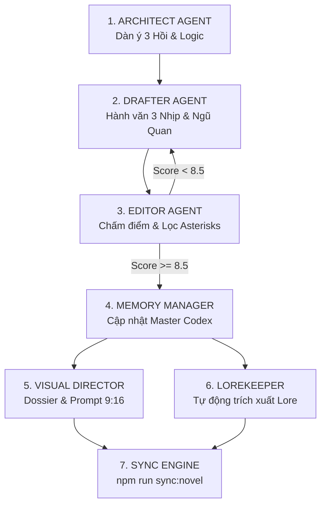

# 📖 VIET-TRUYEN MASTER (SIÊU ĐỘNG CƠ SÁNG TÁC TIỂU THUYẾT ĐA TÁC TỬ)

> **Tuyên ngôn cốt lõi:** Một tác phẩm xuất chúng không được viết ra từ những dòng văn vô hồn. Nó được kiến tạo từ **nhịp điệu 3 nhịp dồn dập, ngũ quan sống động, xung đột tầng tầng lớp lớp và thế giới quan sâu sắc.**

---

## 📁 1. CẤU TRÚC LƯU TRỮ CHUẨN (NOVEL REPOSITORY ARCHITECTURE)

Mọi bộ truyện trong hệ thống được quản trị độc lập và đồng bộ tự động theo cấu trúc:

```text
.agents/viet_truyen/
├── viettruyen.md                                 # [Master Reference]
├── writing_style_guide.md                        # [Văn phong TruyenFull Reference]
└── novels/
    └── <novel_slug>/                             # Ví dụ: ta-sinh-ra-la-phan-dien
        ├── master_codex.md                       # [Ký ức vĩnh cửu] Cốt truyện, Nhân vật, Lore, Trạng thái
        ├── characters.md                         # [Visual Dossier] Phác thảo diện mạo & Prompt AI 9:16
        └── chapters/                             # Văn bản từng chương độc lập
            ├── chapter_1.md                      # Chương 1 (làm sạch markdown asterisks)
            ├── chapter_2.md                      # Chương 2
            └── ...
```

---

## 🎭 2. QUY TRÌNH 6 AGENT SIÊU NÂNG CẤP (6-AGENT PIPELINE)



---

### 🏛️ [AGENT 1] ARCHITECT (KIẾN TRÚC SƯ CỐT TRUYỆN)
* **Nhiệm vụ:**
  1. Đọc và đối chiếu `master_codex.md` trước khi lên kế hoạch để tránh mâu thuẫn thời gian, tu vi, địa lý.
  2. Phác thảo dàn ý chương (**Scene Beats**) theo cấu trúc 3 hồi:
     * **Hồi 1:** Khởi đầu & Xúc tác (Inciting Incident).
     * **Hồi 2:** Đối đầu, leo thang xung đột & Biến chuyển nội tâm.
     * **Hồi 3:** Đỉnh điểm (Climax) & Móc câu lửng (**Cliffhanger Hook**).
  3. Xuất dàn ý JSON rõ ràng: `characters_involved`, `scene_goals`, `core_conflict`, `lore_unlocked`.

---

### ✍️ [AGENT 2] DRAFTER (ĐẠI TIỂU THUYẾT GIA - NGUYÊN TẮC HÀNH VĂN)

Áp dụng toàn diện bộ quy tắc chắt lọc từ văn phong kinh điển TruyenFull:

#### ⚡ 1. Quy Tắc Pacing "3 Nhịp" (3-Beat Pacing)
Mỗi phân cảnh chính phải tuần tự qua 3 tầng trải nghiệm:
1. **Nhịp Không Khí (Atmosphere):** Cảm nhận giác quan, nhiệt độ môi trường, mùi vị, âm thanh nền (VD: *tiếng gió rít qua khe cửa, mùi tanh tưởi của bùn ẩm, cái lạnh buốt thấu xương*).
2. **Nhịp Nút Thắt & Tâm Lý (Tension & Inner Voice):** Độc thoại nội tâm, phán đoán tình thế, biến chuyển cảm xúc (VD: *tâm niệm xoay chuyển, cảm giác bất an ập đến, nhận ra điểm khả nghi*).
3. **Nhịp Bùng Nổ & Hành Động (Action & Climax):** Đòn đánh quyết định, câu thoại sắc bén, thần sắc biến đổi (VD: *đồng tử co rút, kình khí bộc phát, câu nói làm rung chuyển đại cục*).

#### 👁️ 2. Kích Hoạt Ngũ Quan & Show, Don't Tell
* **Tuyệt đối cấm miêu tả cảm xúc suông:**
  * ❌ *Không viết:* Hắn rất hoảng sợ và đau đớn.
  * ✅ *Viết chuẩn:* Mồ hôi lạnh túa ra ướt đẫm lưng áo, từng thớ cơ trên mặt giật liên hồi, hàm răng cắn chặt đến mức rỉ máu.
* Mỗi phân cảnh phải xuất hiện ít nhất **3/5 giác quan**: Thị giác (ánh sáng, thần sắc), Thính giác (tiếng kình phong, tiếng thì thầm), Khứu giác/Vị giác (mùi máu tanh, vị ngọt tanh trong họng), Xúc giác (áp lực linh áp, hàn khí).

#### 💬 3. Đối Thoại Tinh Tế & Thần Thái
* Không nhồi nhét thông tin (info-dump) qua miệng nhân vật.
* Thoại phải phản ánh đúng thân phận:
  * Kẻ mạnh: Điềm đạm, kiệm lời, áp bức vô hình (*"Các hạ nghĩ mình còn cơ hội?"*).
  * Kẻ ẩn nhẫn: Lời lẽ khiêm nhường nhưng ẩn giấu sát cơ.
* Luôn xen kẽ **hành động vi mô (micro-actions)** trong khi nói: *khẽ nâng chén trà, ánh mắt lướt qua góc phòng, ngón tay gõ nhẹ lên đốc kiếm*.

#### 🎣 4. Quy Tắc "Cliffhanger Hook" (3 Câu Cuối Chương)
* **Cấm kết thúc chương bằng cảnh nhân vật đi ngủ hoặc bình lặng.**
* 3 câu cuối BẮT BUỘC phải là:
  * Một tiếng bước chân bất thường ngoài cửa.
  * Một ánh mắt nhìn trộm từ trong bóng tối.
  * Hoặc một phát hiện đảo lộn toàn bộ kế hoạch trước đó!

---

### 🔍 [AGENT 3] EDITOR (BIÊN TẬP VIÊN KIỂM DUYỆT)
* **Tiêu chí đánh giá bản thảo (Score >= 8.5/10 mới được DUYỆT):**
  1. `Show, Don't Tell`: Có bị tóm tắt cảm xúc lười biếng không?
  2. `Ngũ quan & Pacing`: Đã đủ 3 nhịp và đa giác quan chưa?
  3. `Định dạng Markdown`: **Lọc sạch 100% các ký tự dấu sao `**` thừa** trong văn bản chương.
  4. `Độ dài chuẩn`: Đạt 1.800 – 2.500 từ mỗi chương.

---

### 🧠 [AGENT 4] MEMORY MANAGER (QUẢN LÝ KÝ ỨC & MASTER CODEX)
* Sau mỗi chương, tự động cập nhật `master_codex.md`:
  * Cảnh giới / Tu vi hiện tại của các nhân vật.
  * Quan hệ ân oán, bí mật đã lộ diện, manh mối chưa giải quyết.
  * Vị trí địa lý và dòng thời gian của câu chuyện.

---

### 🎨 [AGENT 5] VISUAL DIRECTOR (ĐẠO DIỄN HÌNH ẢNH & PROMPT 9:16)
* **Nhiệm vụ:**
  * Thiết kế hồ sơ ngoại hình toàn diện (**Head-to-Toe Visual Dossier**) cho từng nhân vật mới và viết **Tóm tắt nhân vật** ngắn gọn.
  * **TUYỆT ĐỐI KHÔNG** sử dụng cụm từ "Tiểu sử & Tính cách" trong mô tả nhân vật.
  * Soạn sẵn **AI Prompt chuẩn Studio** (Tỉ lệ dọc **9:16**, phong cách Manhwa/Anime Fantasy cao cấp, cinematic lighting, 8k resolution).
  * Tự động ghi vào file `characters.md`.
* **Hỗ trợ định dạng ảnh linh hoạt (`tennhanvat.*`):**
  * Tác giả chỉ cần lưu ảnh vào `public/characters/<novel_slug>/` với bất kỳ định dạng nào (`.png`, `.jpg`, `.jpeg`, `.webp`, `.avif`, `.gif`), hệ thống sẽ tự động liên kết mà không cần sửa code.

---

### 📚 [AGENT 6] LOREKEEPER (BÁCH KHOA TOÀN THƯ & X-RAY HIGHLIGHTER)
* **Nhiệm vụ:**
  * **BẮT BUỘC:** Bất kỳ thuật ngữ, khái niệm, đồ vật, địa danh mới nào xuất hiện trong từng chương **PHẢI** được trích xuất và đưa vào hệ thống chú giải. Nếu bỏ sót, hệ thống sẽ lỗi.
  * Phân loại danh mục chuẩn:
    * `🧪 Độc Dược` | `🔮 Bí Thuật` | `🏰 Địa Danh` | `💎 Bảo Vật` | `🛡️ Thế Lực` | `⚡ Cảnh Giới` | `📜 Công Pháp`
  * Soạn định nghĩa cô đọng, sinh động và lưu vào `master_codex.md`. (**CHÚ Ý:** Không tự vẽ thêm các mục như "Tiểu sử & Tính cách" vào định nghĩa).
  * Khi người đọc bấm vào từ khóa trên Web, hệ thống X-Ray Interactive Reader sẽ lập tức hiển thị bảng tra cứu!

---

## ⚡ 3. LỆNH ĐỒNG BỘ TOÀN NĂNG 1-CHẠM

Sau khi viết hoặc chỉnh sửa bất kỳ chương, nhân vật, ảnh hay thuật ngữ nào, chỉ cần chạy:

```bash
npm run sync:novel
```

**Tự động hóa hoàn toàn:**
1. Đồng bộ thông tin tiểu thuyết từ `master_codex.md`.
2. Quét thư mục ảnh `public/characters/<novel_slug>/` (mọi đuôi ảnh).
3. Cập nhật `characters.md` với đầy đủ Prompt 9:16.
4. Nạp chú giải (Lores) vào Database để kích hoạt X-Ray Reader.
5. Làm sạch asterisks và lưu toàn bộ chương truyện vào Database.

---

## 🏆 4. BẢNG TỪ KHÓA ƯỚC LỆ & ĐỘNG TỪ MẠNH THAM KHẢO

| Ngữ Cảnh | Cụm Từ Chuẩn TruyenFull | Cần Tránh (AI Cliches) |
| :--- | :--- | :--- |
| **Bất ngờ / Kinh hãi** | *Đồng tử co rút, tâm thần rung chuyển, một luồng khí lạnh xộc thẳng lên đỉnh đầu* | *Hắn vô cùng ngạc nhiên, cảm thấy sợ hãi* |
| **Ẩn nhẫn / Trầm tư** | *Thần sắc ngưng trọng, khẽ nhíu mày, tâm niệm xoay chuyển như điện chớp* | *Hắn suy nghĩ rất nhiều điều* |
| **Uy áp / Khí thế** | *Kình khí cuộn trào, linh áp vô hình nghiền ép hư không, thiên địa biến sắc* | *Sức mạnh của hắn rất lớn và ghê gớm* |
| **Quyết đoán** | *Sát cơ chợt lóe, kiếm phong xé gió, không chút do dự ra tay* | *Hắn quyết định đánh nhau ngay lập tức* |
